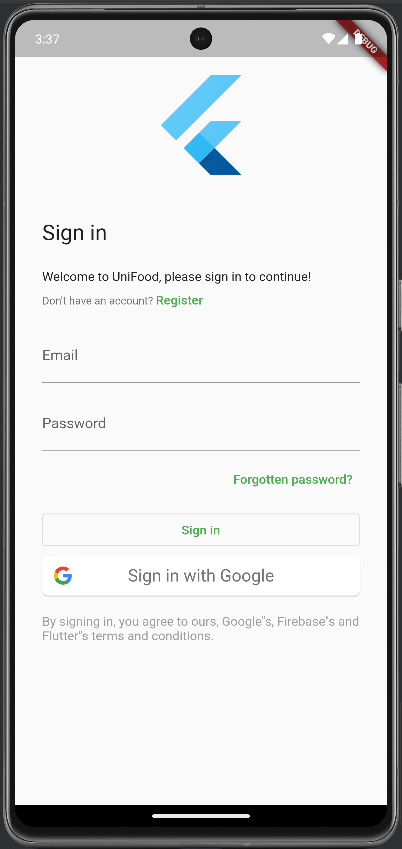
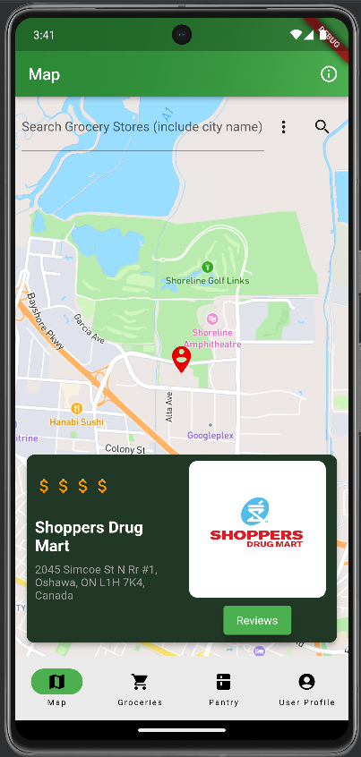
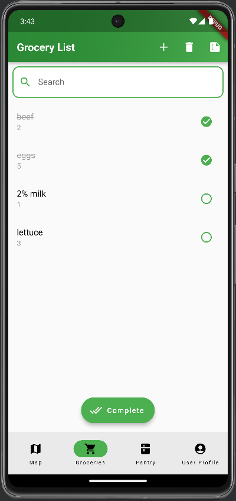
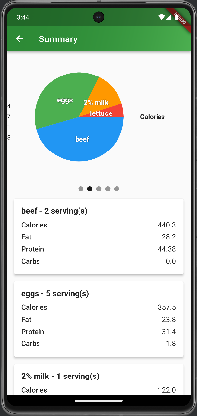
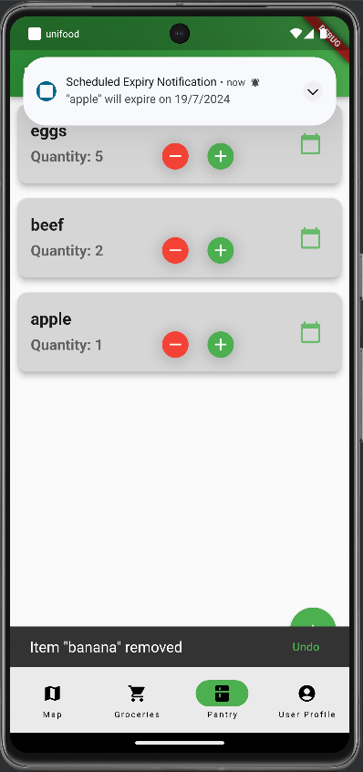
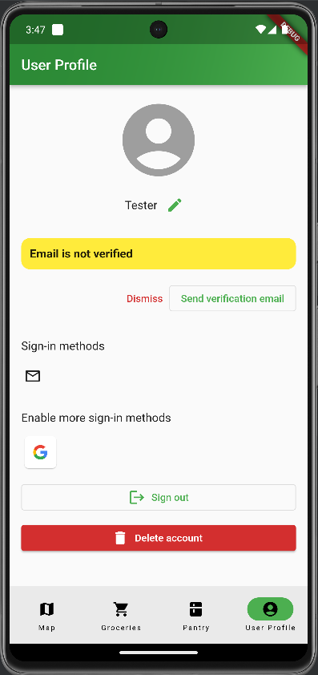

Mobile Application Development - Android Studio

Contributors:

1. Malhar Singh (GitHub username: MalharS1)

2. Li Chen (GitHub username: ShianLiChen)

3. Johnny Liang (GitHub username: JohnnyLiang-OTU)
  

#### Video Link: https://drive.google.com/file/d/1nlYv7ed6CCOybk-Zsh0zXEIusUNtnqFV/view?usp=sharing

_________________________________________________________________________________________________________________________________
## Overview
UniFood is a mobile application designed for post-secondary students to centralize services like grocery shopping, meal planning, and nutrition tracking into a single platform. Powered by APIs such as Firestore and Nutritionix, it provides a seamless experience for busy students looking to organize their meals and groceries efficiently.

## **Below are the screenshots along with the description for each of the screens of this application**

  

**Functionalities:**
- First screen the users interact with when launching the UniFood app
- Login required to save the user's data in the cloud Firestore API [Firestore Documentation](https://firebase.google.com/docs/firestore) as well as locally (SQLite)
- Users can either make an account specific to this app or simply use their Google account (for convenience)
- Returning users can log in (with the option to reset the password), which will be saved the next time the user launches the app
__________________________________________________________________________________________________________________________________
  

  

**Functionalities:**
- From this page and every other page, users can navigate to other screens using the bottom navigation bar
- Search for all grocery stores within a certain radius or a specific store
- View the store's reviews (specific for this app) and price range of the store (displayed with "$" signs)
__________________________________________________________________________________________________________________________________
  

  

**Functionalities:**
- Add, delete, and manage items 
- Users can check the nutrition summary for all the items (explained more in the next screenshot)
- Users can also move selected items to the pantry page (explained more in the pantry page screenshot)

  

  

**Functionalities:**
- Here Users can see nutritional facts for their groceries powered by [Nutritionix API](https://www.nutritionix.com/)
- This page includes a text Summary of food quantity, calories, fat, protein, and carbs, along with a visual pie chart 
__________________________________________________________________________________________________________________________________
  

  

**Functionalities:**
- Add specific items from this page or move the items from the grocery page
- Increase or decrease the quantity of items (swiping left or setting count to 0 will remove the item)
- Schedule expiry notifications for items
- If an item is accidentally removed, users can undo the action
__________________________________________________________________________________________________________________________________
  

  

**Functionalities:**
- This is the user's profile page
- Users can edit their information such as their username, profile picture, and sign-in methods
- Option to sign or delete the user's account
__________________________________________________________________________________________________________________________________

### Summary of Functionalities and Technologies
- Dialogs and pickers
- Multiple screens and navigation
- Snack bars
- Notifications
- Local storage (SQLite)
- Cloud storage (Firestore)
- HTTP requests
- Charts
- Map
- Geolocation
- Geocoding
- Internationalization (can change device language to Spanish for the Spanish translation of the app)
